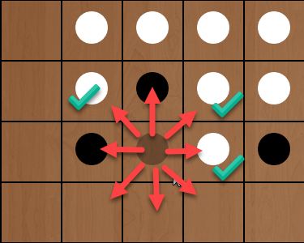
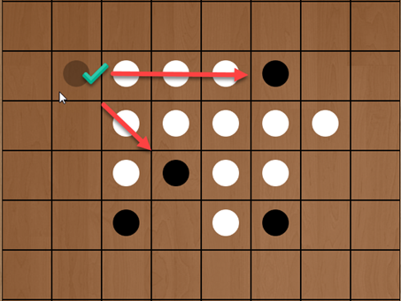
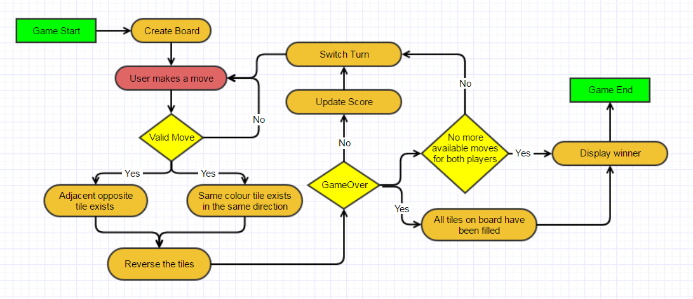
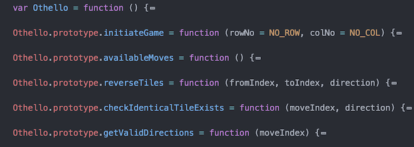
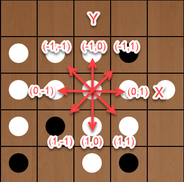
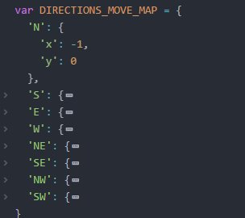
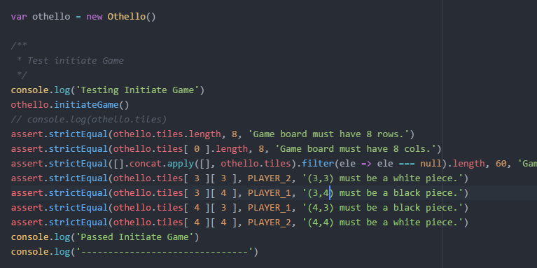
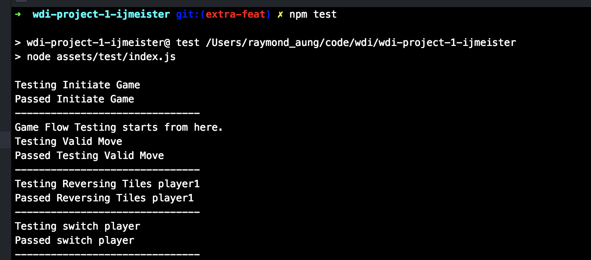

# Othello

#### View [Demo](https://wdi-sg.github.io/wdi-project-1-ijmeister/)

## Game Setup

1. Game Board 8 x 8, 64 black or white pieces
2. starting position white, black, black, white (diagonal) at the center of the board.

## Game Play

1. Player1 (Black) starts first
2. Valid Move needs to fulful 2 conditions.
  - There needs to be at least one opposing adjacent tile.  
  - in that same direction, there needs to be an identical tile.
3. If one player can not make a valid move, play passes back to the other player. When neither player can move, the game ends.
4. The player with the most pieces on the board at the end of the game wins.

## Game Flow Diagram

## Code Design

### Follows OOP

### Main logic

- Traversing the grid as (x,y) coordinate from one tile to another, when checking for the 2 required conditions for the player move

### TDD

- Main logic was first built and tested simultaneously with npm test cases

## Project Stages

1. Requirements / Design
2. Game Logic
3. UI
4. AI (stretch goal) - Future improvement

## Reference
1. https://en.wikipedia.org/wiki/Reversi
2. http://www.othelloonline.org/
3. background image from [here](http://google.com)
